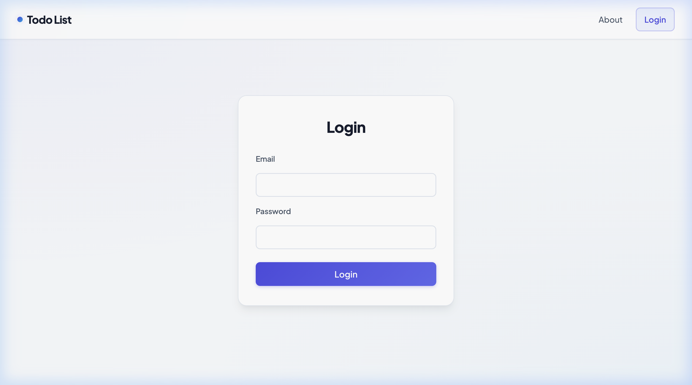
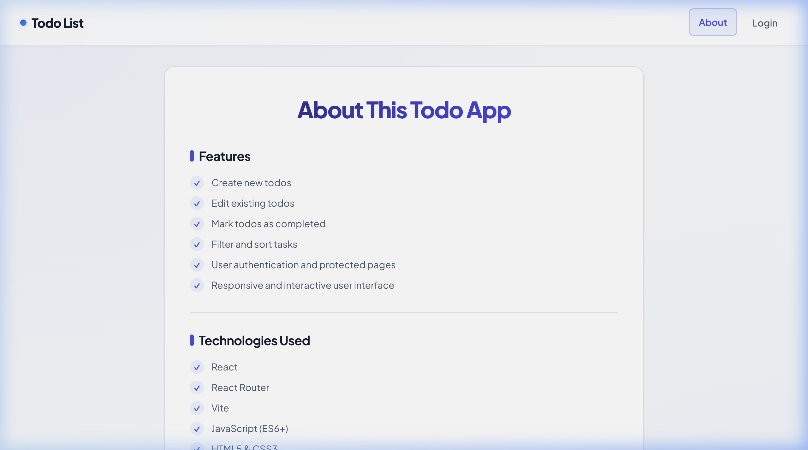
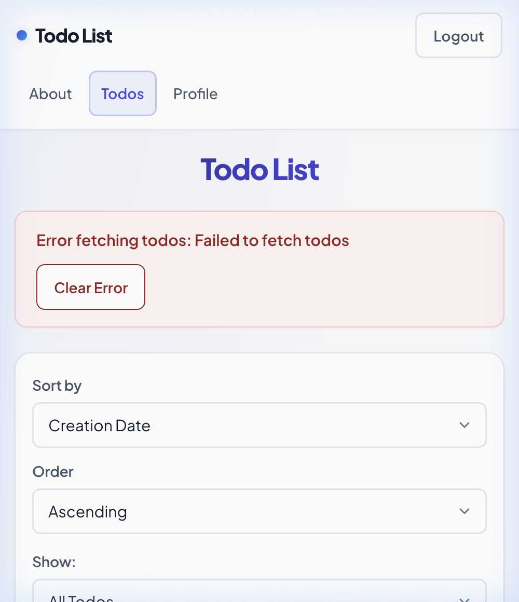
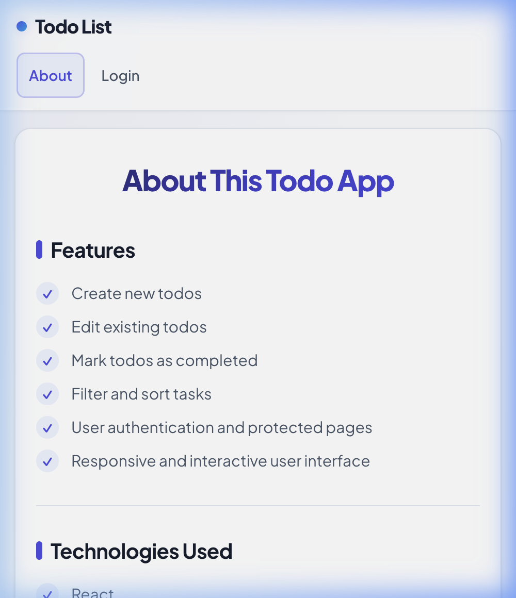

# Todo List Management Application 

A modern, fast, and accessible task management web application built with **React 19**, **React Router**, **Vite**, and scoped **CSS Modules**. Todo list an intuitive user experience with optimistic UI updates, debounced search filtering, custom styled checkboxes, client-side input sanitization, and responsive design tailored for mobile, tablet, and desktop screens.

---

## Live Demo

- **Live Application:** [TaskFlow on GitHub Pages / Deployment](https://github.com/tryphenap/todo-listRect26SummerCodeTheDream) *(Deploy link will appear here upon deployment)*
- **Local Development URL:** `http://localhost:3001`

---

## Features

- **Task Management**:
  - **Create Tasks**: Add new tasks with client-side validation and instant feedback.
  - **Inline Editing**: Double-click or click "Edit" to modify task titles directly with escape/cancel support.
  - **Custom Checkboxes**: Accessible custom checkboxes with animated SVG checkmarks to toggle task completion.
  - **Optimistic Updates**: Immediate UI responsiveness with automatic rollback if a network error occurs.
- **Search & Filtering**:
  - **Status Filter**: Switch seamlessly between *All Tasks*, *Active Tasks*, and *Completed Tasks* (persisted via URL query parameters).
  - **Debounced Search**: Search tasks in real-time with an optimized 300ms debounce delay to minimize redundant server requests.
  - **Multi-criteria Sorting**: Sort tasks by creation date or title in ascending or descending order.
- **Security & Validation**:
  - **Client-Side Sanitization**: Strips HTML tags and script injection vectors before data is processed or stored.
  - **Length Limits**: Strict `maxLength` constraints on all inputs (100 chars for tasks/search, 254 for email, 128 for password).
  - **Secure Error Messaging**: Friendly, user-centric alerts that never expose backend stack traces, database details, or server hostnames.
- **Authentication & Dashboard**:
  - **Protected Routes**: Restricts task management and profile access to authenticated users.
  - **User Profile Dashboard**: Displays account statistics, total task count, completed tasks, and a calculated completion rate.
  - **Session Management**: CSRF token validation and secure logon/logoff flow.
- **Responsive & Accessible Design**:
  - **Mobile-First Touch Targets**: All interactive elements (buttons, checkboxes, dropdowns, links) meet or exceed the 44px minimum touch target.
  - **Zero Horizontal Scrolling**: Adaptive layouts that scale gracefully from small mobile viewports (375px) to ultra-wide displays.
  - **Keyboard Accessible**: Visible focus indicators (`:focus-visible`) for all focusable controls.

---

## Technologies Used

- **Core Framework**: [React 19](https://react.dev/)
- **Routing**: [React Router](https://reactrouter.com/)
- **Build Tool**: [Vite](https://vite.dev/)
- **Styling**: Scoped CSS Modules (`.module.css`) and Vanilla CSS Custom Properties

---

## Screenshots

### Desktop View
| Login & Authentication | About & Architecture |
|:---:|:---:|
|  |  |

### Mobile View
| Mobile Task Dashboard | Mobile About Page |
|:---:|:---:|
|  |  |

---

## Getting Started

### Prerequisites
Make sure you have the following installed on your machine:
- **Node.js**: `v18.0.0` or higher
- **npm**: `v9.0.0` or higher

### Installation

1. **Clone the repository:**
   ```bash
   git clone https://github.com/tryphenaP/todo-listRect26SummerCodeTheDream.git
   cd todo-listRect26SummerCodeTheDream
   ```

2. **Install dependencies:**
   ```bash
   npm install
   ```

3. **Configure environment variables:**
   Create a `.env` file in the root directory (or copy from `.env.example`):
   ```env
   VITE_TARGET=https://ctd-learns-node-l42tx.ondigitalocean.app
   ```

4. **Start the development server:**
   ```bash
   npm run dev
   ```

5. **Open in your browser:**
   Navigate to [http://localhost:3001](http://localhost:3001) to view the running app.

---

## Available Scripts

In the project directory, you can run:

| Command | Description |
|:---|:---|
| `npm run dev` | Starts the Vite development server with Hot Module Replacement (HMR) at port `3001`. |
| `npm run build` | Builds the production-ready bundle into the `dist` directory. |
| `npm run preview` | Locally serves the production build from `dist` to test before deployment. |

---

## Design Decisions

- **Scoped CSS Modules**: Components use `.module.css` to keep styles isolated and prevent class name conflicts.
- **CSS Variables**: Global colors, typography, spacing, and border radii are defined in `src/index.css` for visual consistency.
- **Responsive Layout**: Designed to work smoothly across mobile, tablet, and desktop screens with flexible layouts and touch-friendly controls.
- **Input Validation & Sanitization**: Form inputs sanitize user text and enforce character limits before submitting.
- **Optimistic UI Updates**: Task interactions update immediately for a responsive feel, rolling back safely if a request fails.

---

## Future Improvements

- [ ] **Drag and Drop**: Allow users to reorder tasks visually using pointer/touch drag gestures.
- [ ] **Categories & Tags**: Support color-coded categories (e.g., Work, Personal, Urgent).
- [ ] **Due Dates & Reminders**: Add date pickers with reminders for upcoming or overdue tasks.
- [ ] **Dark Mode Theme**: Implement a system-aware dark mode toggle using CSS token overrides.
- [ ] **Offline PWA Support**: Implement service worker caching for offline task creation and background synchronization.

---

## License

This project is licensed under the **MIT License** — see the [LICENSE](LICENSE) file for details.

---

## Contact & Acknowledgments

- **Developer**: [tryphenaP](https://github.com/tryphenaP)
- **GitHub Repository**: [https://github.com/tryphenaP/todo-listRect26SummerCodeTheDream](https://github.com/tryphenaP/todo-listRect26SummerCodeTheDream)
